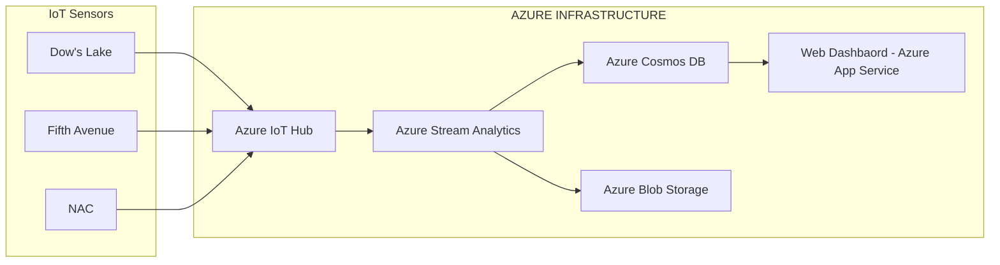
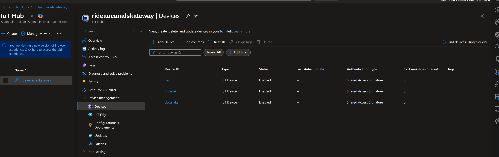
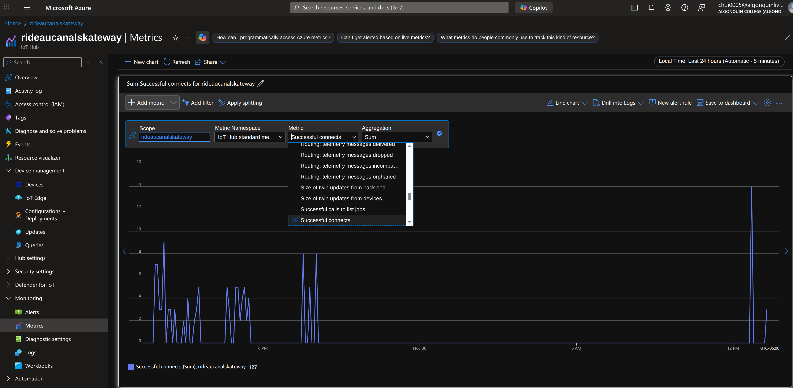
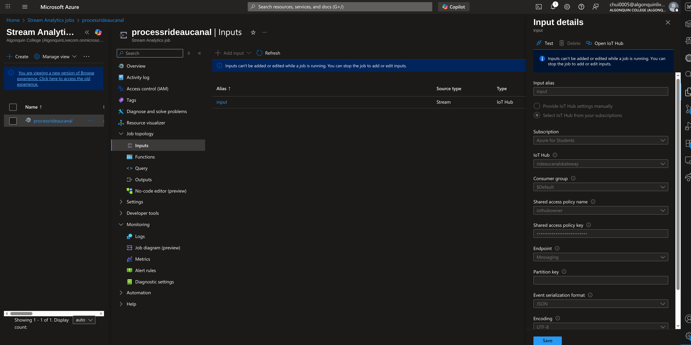
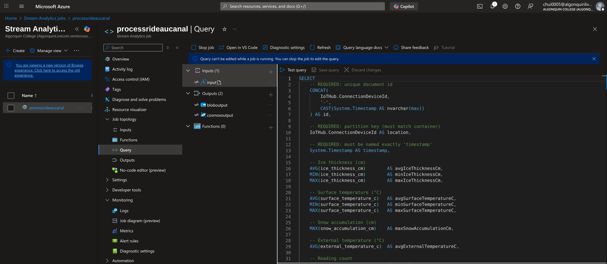
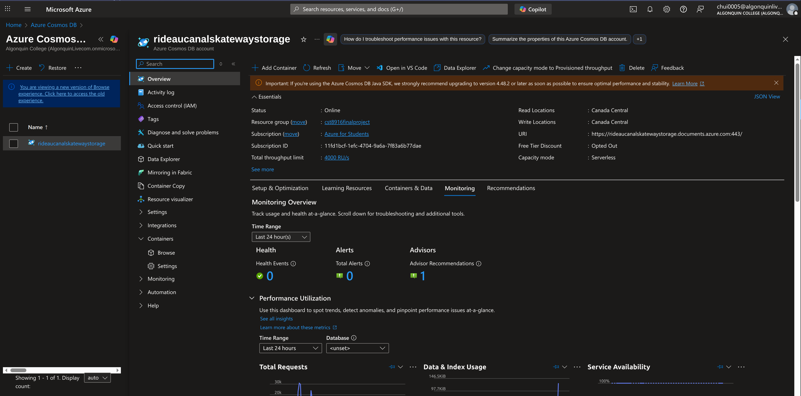
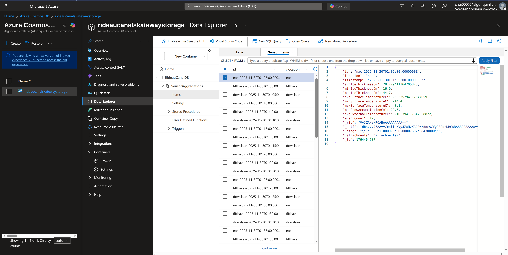
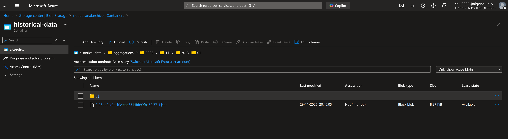
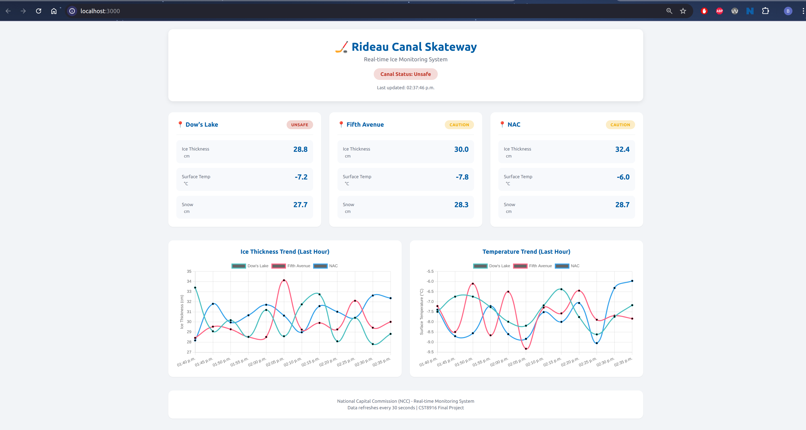

# Rideau Canal Environmental Sensor Monitoring System

## Project Description

The Rideau Canal Environmental Sensor Monitoring System is a cloud-based monitoring and visualization platform designed to track winter canal conditions in near real time. The system ingests environmental telemetry from distributed IoT sensors placed along the Rideau Canal, aggregates the data in time-based windows, and stores the results in a scalable cloud database for analysis and visualization.

Key metrics monitored include ice thickness, surface temperature, external air temperature, and snow accumulation. Aggregated sensor data is processed using Azure IoT Hub and Stream Analytics, persisted in Azure Cosmos DB, and surfaced through a web-based dashboard hosted on Azure App Service. The dashboard enables operators and stakeholders to assess safety conditions, observe trends over time, and make informed decisions related to canal operations and public safety.

The architecture emphasizes scalability, reliability, and real-time insight, making it well suited for continuous environmental monitoring scenarios.

## Student Information

-  Name: Bryan Chuinkam
-  Student number: 040811108

### Associated Repositories 
- [Sensor Simulation Repository](https://github.com/chui0005/rideau-canal-sensor-simulation)
- [Sensor Simulation Dashboard](https://github.com/chui0005/rideau-canal-sensor-dashboard)
- [Link to live dashbaord]()


## Scenario Overview
Monitoring ice and weather conditions along the Rideau Canal during winter is critical for public safety and operational decision-making. Traditionally, assessments of canal conditions rely on periodic manual inspections and isolated measurements, which can be time-consuming, infrequent, and unable to capture rapid environmental changes. Variations in temperature, ice thickness, and snow accumulation can occur over short periods and differ significantly across locations, making it difficult to maintain an accurate and timely understanding of overall canal safety.

Without a centralized, real-time monitoring system, decision-makers lack consistent visibility into canal conditions, increasing the risk of delayed responses to unsafe ice conditions and inefficient allocation of operational resources.

### System Objectives

The Rideau Canal Environmental Sensor Monitoring System is designed to address these challenges by achieving the following objectives:

- Provide Near Real-Time Visibility
- Improve Safety Decision-Making
- Centralize Environmental Data
- Support Scalability and Reliability
- Enable Data-Driven Planning by Preserve historical telemetry. 

## System Architecture




### Data Flow Explanation

#### IoT Sensors (Edge Layer)
Environmental sensors deployed at multiple locations along the Rideau Canal collect telemetry data, including ice thickness, surface temperature, external temperature, and snow accumulation. Each sensor is uniquely identified by a device ID.

#### Azure IoT Hub (Ingestion Layer)
Sensor devices securely transmit telemetry to Azure IoT Hub using device identities and connection strings. IoT Hub acts as the central ingestion point, providing reliable, scalable message ingestion with built-in device management.

#### Azure Stream Analytics (Processing Layer)
Azure Stream Analytics consumes the event stream from IoT Hub and processes incoming telemetry in near real time.

Events are grouped by sensor (device ID)

Time-based tumbling windows (e.g., 5 minutes) are applied

Aggregations such as averages, minimums, maximums, and counts are calculated

#### Azure Cosmos DB (Storage Layer)
Aggregated results are written to an Azure Cosmos DB container using the SQL API. Data is partitioned by sensor location to ensure scalable storage and efficient queries for both recent and historical analysis.

#### Azure Blob Storage (Archive)
In parallel, aggregated data is also written to Azure Blob Storage for long-term retention, .

#### Web Dashboard (Presentation Layer)
A Node.js and Express-based web application retrieves aggregated data from Cosmos DB via REST APIs. The dashboard presents trends, safety indicators, and historical charts to users through a browser-based interface.

## Implementation Overview
 [IoT Sensor Simulation](https://github.com/chui0005/rideau-canal-sensor-simulation): Python-based IoT sensor simulator that sends telemetry data to Azure IoT Hub.

 **Azure IoT Hub**

 - CONFIGURATION
 
 
 - METRICS
 

**Stream Analytics job**
- INPUTS 


- OUTPUTS
stream_analytics_input.png

- QUERY
  - Screenshot of query in Stream Analytics query editor. 
    - Also shows that query is running


FULL QUERY
```sql
SELECT
    -- REQUIRED: unique document id
    CONCAT(
        IoTHub.ConnectionDeviceId,
        '-',
        CAST(System.Timestamp AS nvarchar(max))
    ) AS id,

    -- REQUIRED: partition key (must match container)
    IoTHub.ConnectionDeviceId AS location,

    -- REQUIRED: must be named exactly 'timestamp'
    System.Timestamp AS timestamp,

    -- Ice thickness (cm)
    AVG(ice_thickness_cm)        AS avgIceThicknessCm,
    MIN(ice_thickness_cm)        AS minIceThicknessCm,
    MAX(ice_thickness_cm)        AS maxIceThicknessCm,

    -- Surface temperature (°C)
    AVG(surface_temperature_c)   AS avgSurfaceTemperatureC,
    MIN(surface_temperature_c)   AS minSurfaceTemperatureC,
    MAX(surface_temperature_c)   AS maxSurfaceTemperatureC,

    -- Snow accumulation (cm)
    MAX(snow_accumulation_cm)    AS maxSnowAccumulationCm,

    -- External temperature (°C)
    AVG(external_temperature_c)  AS avgExternalTemperatureC,

    -- Reading count
    COUNT(*)                     AS eventCount

INTO [cosmosoutput]
FROM [input]
TIMESTAMP BY timestamp
GROUP BY
    IoTHub.ConnectionDeviceId,
    TUMBLINGWINDOW(minute, 5)


SELECT
    IoTHub.ConnectionDeviceId AS location,
    System.Timestamp AS windowEndTime,

    -- Ice thickness (cm)
    AVG(ice_thickness_cm)        AS avgIceThicknessCm,
    MIN(ice_thickness_cm)        AS minIceThicknessCm,
    MAX(ice_thickness_cm)        AS maxIceThicknessCm,

    -- Surface temperature (°C)
    AVG(surface_temperature_c)   AS avgSurfaceTemperatureC,
    MIN(surface_temperature_c)   AS minSurfaceTemperatureC,
    MAX(surface_temperature_c)   AS maxSurfaceTemperatureC,

    -- Snow accumulation (cm)
    MAX(snow_accumulation_cm)    AS maxSnowAccumulationCm,

    -- External temperature (°C)
    AVG(external_temperature_c)  AS avgExternalTemperatureC,

    -- Count of readings
    COUNT(*)                     AS eventCount


INTO [bloboutput]
FROM [input]
TIMESTAMP BY timestamp
GROUP BY
    IoTHub.ConnectionDeviceId,
    TUMBLINGWINDOW(minute, 5)

```

**Cosmos DB setup**
- CONFIGURATION 



- DB Data Explorer with sample documents



**Blob Storage configuration**
- CONTAINER 



**Web Dashboard**

[Sensor Simulation Dashboard REPO](https://github.com/chui0005/rideau-canal-sensor-dashboard)

- Dashboard running locally


## Setup Instructions

Prerequisites
High-level setup steps
Links to detailed setup in component repos
Results and Analysis

## Sample outputs and screenshots
Data analysis
System performance observations