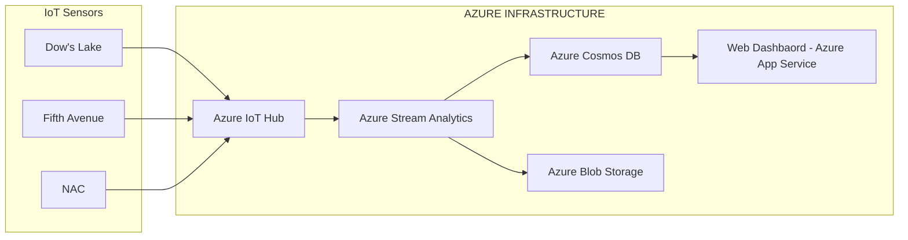

## System Architecture

```mermaid
flowchart LR
    subgraph IoT Sensors
        C1[Dow's Lake]
        C2[Fifth Avenue]
        C3[NAC]
    end


  subgraph AZURE INFRASTRUCTURE
    IOTHUB[Azure IoT Hub]
    ASA[Azure Stream Analytics]
    ACOS[Azure Cosmos DB]
    ABS[Azure Blob Storage]
    AAS[Web Dashbaord - Azure App Service]
  end 

    C1 --> IOTHUB
    C2 --> IOTHUB
    C3 --> IOTHUB

    IOTHUB[Azure IoT Hub] --> ASA
    ASA --> ACOS
    ASA --> ABS
    ACOS --> AAS
```
